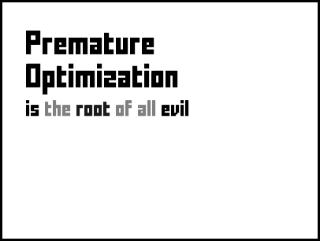

# code
They said,

> Talk is cheap, show me the code.

But is that enough? Everyone needs a code, more than code. Here is mine.

First and foremost, I am an engineer. I like finding problems. I like solving them well.  I hope everytime that I don't create new ones. I don't keep Donald Knuth's *The Art of Computer Programming*  handy, but these words always ring in my head when I start looking for solutions:

> Premature optimization is the root of all evil.

I admit I haven't found the best way to show this, but that's the whole point!

PERL is much less used now than it was two decades ago. *Bless* Larry Wall, if you understand what I mean. Once you think you've *solved* a problem, think again:

> There is more than one way to do it.

I kind of like the > sign for this one....

Money, likes, shares, subscribes motivate you, eh mere mortal ? Asks Kannada poet D.V. Gundappa (DVG). Unravelling my thirst for recognition helps me understand more of myself...

> ಅನ್ನದಾತುರಕಿಂತ ಚಿನ್ನದಾತುರ ತೀಕ್ಷ್ಣ ।
> 
> ಚಿನ್ನದಾತುರಕಿಂತ ಹೆಣ್ಣುಗಂಡೊಲವು ।।
>
> ಮನ್ನಣೆಯ ದಾಹವೀಯೆಲ್ಲಕುಂ ತೀಕ್ಷ್ಣತಂ ।
>
> ತಿನ್ನುವುದಾತ್ಮವನೇ - ಮಂಕುತಿಮ್ಮ ।। 

(Read [this](https://mankutimma-aphor.blogspot.com/2012/12/652.html) for context and translation)

This is the essence:

Try not to waste anything. Not even a grain of rice, teaches Tiruvalluvar, Tamil poet and saint.

Kabir reminds me to keep contributing. An incessant reminder to continually strive for inclusive growth:

> बडा हुआ तो क्या हुआ , जैसे पेड खजूर |
>
> पंथी को छाया नहीं, फल लागे अति दूर || 

(My translation with a twist: Don't grow like a date palm. You won't shade anyone, and distant shall be your fruits!)

Cutting out the verbose mode yields:

 

With growth comes power. And with great power comes greater responsibility. But well, do you really need it - asks Charlie Chaplin:

> You need power only when you want to do something harmful, otherwise love is enough to get everything done

Finally, Gandhi:

> The Earth has enough for everyone's need, but not for everyone's greed

My code however has no need to attribute the greed to others. As the elders would say - point one finger at others and three point at you. So, the code just says:

> The Earth has enough for My Needs, but not for My Greed

But that's not snazzy enough. Let's give it a punch, shall we?

> The World is NOT enough for my greed, but enough for my needs

It looks better this way:

# disclaimer

One for the gags and the required disclaimers!

> Don't follow me, and don't get lost!
>
> @shreekumar3d

Here's what that looks like, in past tense:

# epilogue

The real riches, perhaps, are in contemplating what this means:

> ಸರ್ವೇ ಭವಂತು ಸುಖಿನಃ ।
> 
> ಸರ್ವೇ ಸಂತು ನಿರಾಮಯಾ: ।
> 
> ಸರ್ವೇ ಭದ್ರಾಣಿ ಪಶ್ಯಂತು ।
> 
> ಮಾ ಕಶ್ಚಿದ್ ದುಃಖ ಭಾಗಭವೇತ್ ।
>
> सर्वे भवन्तु सुखिनः ।
> 
> सर्वे सन्तु निरामयाः ।
> 
> सर्वे भद्राणि पश्यन्तु ।
> 
> मा कश्चिद्दुःखभाग्भवेत् ।

A useful explanation of this mantra is [here](https://yogabharati.org/article-blog/sarve-bhavantu-sukhinah). Language lawyers will notice that the way I have structured the sentences is somewhat different. It may or may not be an error, bus it is wholly intentional.

This mantra has wide utility. It can be used to enumerate new solutions, improve existing ones, think up new possibilities, strive to understand existing designs, achieve harmony in design...

Here is a short user guide : In the context of what you seek, contemplate on all the shapes and forms ಸರ್ವೇ/सर्वे/"all" can take . 4 permutations of as many combinations that you can come up with (time permitting!). And then try to satisfy all the 4 statements. Hopefully you'll find *the* answer...

PS: Your results may only be as wide as your *survey* (pun intended). 
